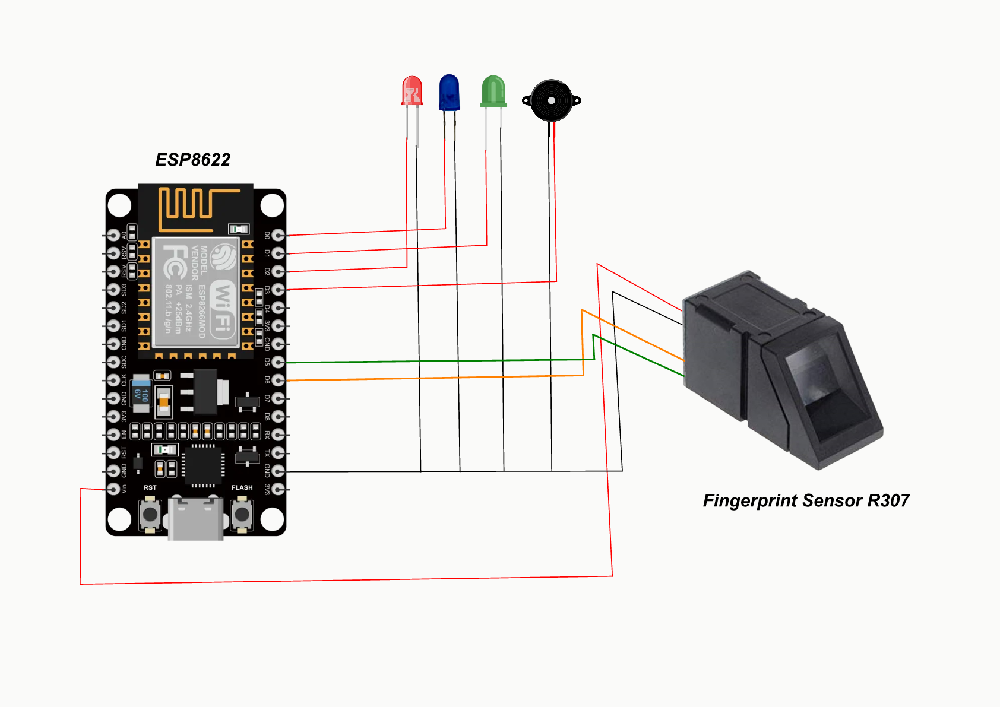

# FRS — Fingerprint Registration System

> Microcontroller Project  
> **Faculty of Engineering · 2nd Year ECE · Beni-Suef University**

A smart attendance system built using **ESP8266**, **R307 Fingerprint Sensor**, **Firebase Firestore**, and **Flutter**.

The system captures fingerprint attendance on-site, syncs records to the cloud, and provides a mobile app for session management and attendance tracking.

---

## 👨‍🏫 Supervised By
**Dr. Laila Abo Hashem**

---

## 📂 Repository Structure

```bash
.
├── paper/                # Research paper / documentation
├── esp/                  # ESP8266 firmware source code
├── mobile/               # Flutter mobile application
├── presentation/         # Project presentation slides
├── hardware_connection.svg
└── README.md
```

---

## 👥 Team

| # | Name |
|---|---|
| 1 | محمد أحمد عبد الرازق حامد |
| 2 | كريم هاني جمال حسن |
| 3 | أنس محمد محمد أحمد عبد اللطيف |
| 4 | عمر أمير خليل مكرم |
| 5 | عمر مجدي محمود عبدربه |
| 6 | يوسف شحات محمد سعيد |
| 7 | علي محمد هلال محمد |
| 8 | محمود أحمد أنور حامد |
| 9 | يوسف حمادة كمال عبد الوهاب |
| 10 | بلال إبراهيم سيد أحمد |

---

## 🏗️ System Architecture

Three main components work together:

```text
ESP8266 + Fingerprint Sensor
        ↓ HTTP / HTTPS
Firebase Firestore
        ↓ SDK / REST
Flutter Mobile App
```

### Components

### 🖥️ ESP8266
- Handles fingerprint scanning
- Connects to Wi-Fi
- Communicates with Firestore REST API
- Uploads attendance records

### ☁️ Firebase Firestore
Stores:
- users
- sessions
- attendance records

### 📱 Flutter Mobile App
Used for:
- session creation
- attendance viewing
- user management

---

## 🔌 Hardware Connection

Use the following diagram to view all hardware wiring:



### Hardware Used
- ESP8266
- R307 Fingerprint Sensor
- Green LED
- Red LED
- Blue LED
- Active Buzzer

---

## 🗄️ Database Schema

### `/records/{auto_id}`

| Field | Type | Description |
|---|---|---|
| fingerprint_id | integer | Sensor fingerprint ID |
| national_id | string | User national ID |
| name | string | User full name |
| time | integer | Epoch timestamp |
| session_id | string | Linked session |

---

### `/sessions/{id}`

| Field | Type |
|---|---|
| name | string |
| start_time | timestamp |

---

## 🔥 Firestore REST API

ESP8266 communicates directly with Firestore.

### 1. Query User by Fingerprint ID

**Endpoint**
```http
POST /documents:runQuery
```

Searches for user record matching scanned fingerprint.

---

### 2. Get Latest Session

**Endpoint**
```http
GET /sessions?orderBy=start_time desc&pageSize=1
```

Gets latest active lecture/session.

---

### 3. Upload Attendance

**Endpoint**
```http
POST /records
```

Creates new attendance record.

---

## ⚙️ Hardware Stack

### ESP8266
- 80 MHz
- Wi-Fi 802.11 b/g/n
- GPIO / UART

### R307 Fingerprint Sensor
- UART communication
- Up to 1000 templates
- Recognition ≈ 1 sec

### Indicators
- **Blue LED** → system ready
- **Green LED** → success
- **Red LED** → error
- **Buzzer** → audio feedback

---

## 🔄 System Flow

```text
Start
 ↓
Initialize System
 ↓
Connect WiFi
 ↓
Sync Time
 ↓
Initialize Fingerprint Sensor
 ↓
Get Latest Session
 ↓
Ready State
 ↓
Scan Fingerprint
 ↓
Query Firestore
 ↓
Upload Attendance
 ↓
Success / Error Feedback
```

---

## 📁 Main Modules

### `/esp`
Contains:
- ESP8266 firmware
- Fingerprint logic
- Firestore API integration

### `/mobile`
Contains:
- Flutter application
- Attendance dashboard
- Session management

### `/paper`
Contains:
- Project paper
- Technical documentation

### `/presentation`
Contains:
- Slides
- Demo material

---

## 🚀 Features

- Fingerprint attendance
- Cloud synchronization
- Session tracking
- Mobile dashboard
- Real-time Firestore integration
- Audio + LED feedback

---

## 🛠️ Technologies

- ESP8266
- Arduino C++
- Firebase Firestore
- REST API
- Flutter
- Dart

---

## 📥 Download

- APK: **https://www.mediafire.com/file/93l2u8e2e9ue4a4/FRS.apk/file**

- Presentation: **https://mhmd-abdelrazek.github.io/frs/presentation**

