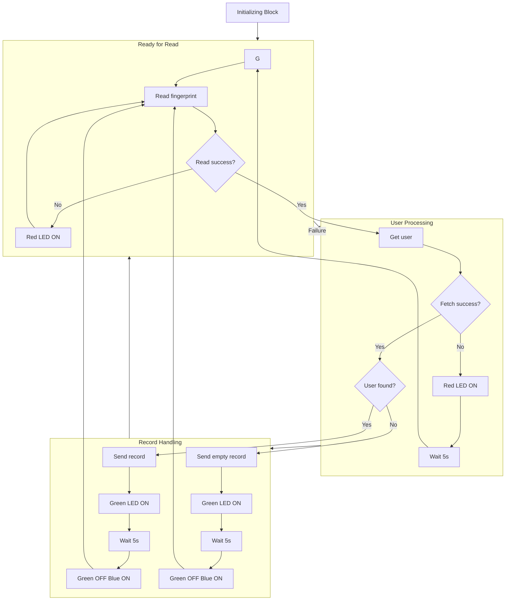

```mermaid
flowchart TD

%% ----------- Initializing -----------
INIT[Initializing Block] --> READY[Ready Block]
READY --> USER[User Processing Block]
USER --> RECORD[Record Handling Block]
USER -.->|Failure| READY
RECORD --> READY


%% ----------- Ready -----------
subgraph READY [Ready for Read]
G --> H[Read fingerprint]
H --> I{Read success?}
I -->|No| J[Red LED ON]
J --> H
end

%% ----------- User -----------
subgraph USER [User Processing]
I -->|Yes| K[Get user]
K --> L{Fetch success?}
L -->|No| M[Red LED ON]
M --> N[Wait 5s]
N --> G
L -->|Yes| O{User found?}
end

%% ----------- Record -----------
subgraph RECORD [Record Handling]
O -->|Yes| P[Send record]
P --> Q[Green LED ON]
Q --> R[Wait 5s]
R --> S[Green OFF Blue ON]
S --> H

O -->|No| T[Send empty record]
T --> U[Green LED ON]
U --> V[Wait 5s]
V --> W[Green OFF Blue ON]
W --> H
end

```
