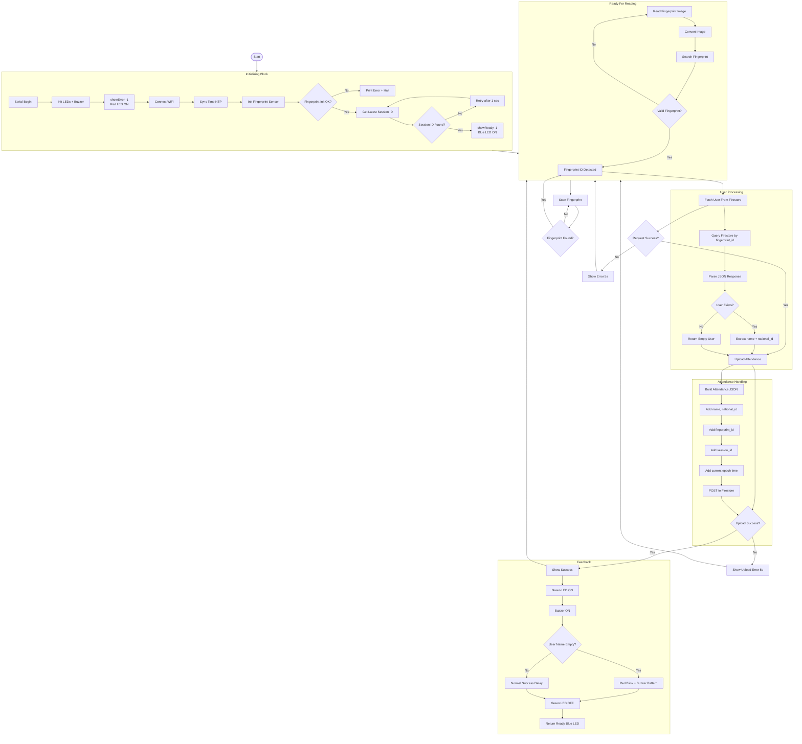

```mermaid
flowchart TD

%% ----------- Main Flow -----------
START([Start]) --> INIT[Setup System]
INIT --> READY[Ready State]
READY --> SCAN[Scan Fingerprint]
SCAN --> CHECK_SCAN{Fingerprint Found?}

CHECK_SCAN -->|No| SCAN

CHECK_SCAN -->|Yes| FOUND[Fingerprint ID Detected]
FOUND --> GETUSER[Fetch User From Firestore]
GETUSER --> CHECK_USER_REQ{Request Success?}

CHECK_USER_REQ -->|No| USER_ERR[Show Error 5s]
USER_ERR --> READY

CHECK_USER_REQ -->|Yes| UPLOAD[Upload Attendance]
UPLOAD --> CHECK_UPLOAD{Upload Success?}

CHECK_UPLOAD -->|No| UPLOAD_ERR[Show Upload Error 5s]
UPLOAD_ERR --> READY

CHECK_UPLOAD -->|Yes| SUCCESS[Show Success]
SUCCESS --> READY

%% ----------- Setup Block -----------
subgraph INIT [Initializing Block]
A1[Serial Begin]
A2[Init LEDs + Buzzer]
A3[showError -1<br/>Red LED ON]
A4[Connect WiFi]
A5[Sync Time NTP]
A6[Init Fingerprint Sensor]
A7{Fingerprint Init OK?}
A8[Print Error + Halt]
A9[Get Latest Session ID]
A10{Session ID Found?}
A11[Retry after 1 sec]
A12[showReady -1<br/>Blue LED ON]

A1 --> A2 --> A3 --> A4 --> A5 --> A6 --> A7
A7 -->|No| A8
A7 -->|Yes| A9 --> A10
A10 -->|No| A11 --> A9
A10 -->|Yes| A12
end

%% ----------- Scan Block -----------
subgraph READY [Ready For Reading]
B1[Read Fingerprint Image]
B2[Convert Image]
B3[Search Fingerprint]
B4{Valid Fingerprint?}

B1 --> B2 --> B3 --> B4
B4 -->|No| B1
B4 -->|Yes| FOUND
end

%% ----------- User Fetch Block -----------
subgraph USER [User Processing]
C1[Query Firestore by fingerprint_id]
C2[Parse JSON Response]
C3{User Exists?}
C4[Extract name + national_id]
C5[Return Empty User]

GETUSER --> C1 --> C2 --> C3
C3 -->|Yes| C4 --> UPLOAD
C3 -->|No| C5 --> UPLOAD
end

%% ----------- Upload Block -----------
subgraph RECORD [Attendance Handling]
D1[Build Attendance JSON]
D2[Add name, national_id]
D3[Add fingerprint_id]
D4[Add session_id]
D5[Add current epoch time]
D6[POST to Firestore]

UPLOAD --> D1 --> D2 --> D3 --> D4 --> D5 --> D6 --> CHECK_UPLOAD
end

%% ----------- Success Feedback -----------
subgraph SUCCESS_BLOCK [Feedback]
E1[Green LED ON]
E2[Buzzer ON]

E3{User Name Empty?}

E4[Red Blink + Buzzer Pattern]
E5[Normal Success Delay]

E6[Green LED OFF]
E7[Return Ready Blue LED]

SUCCESS --> E1 --> E2 --> E3
E3 -->|Yes| E4 --> E6
E3 -->|No| E5 --> E6
E6 --> E7
end


```
